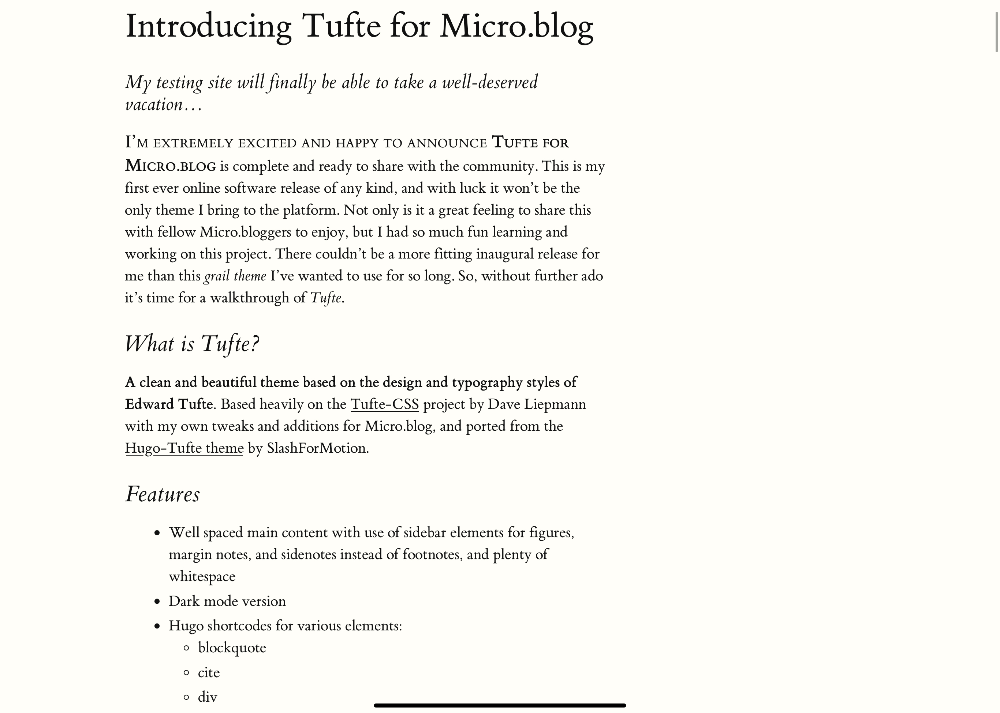
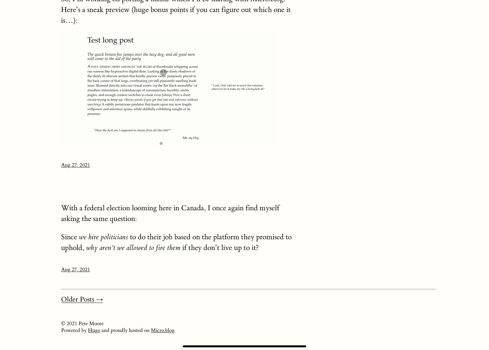
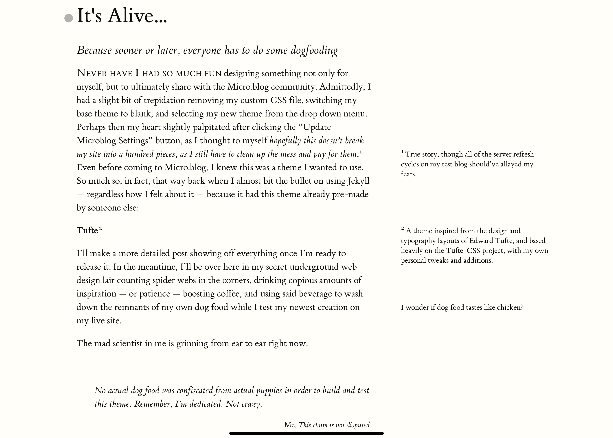
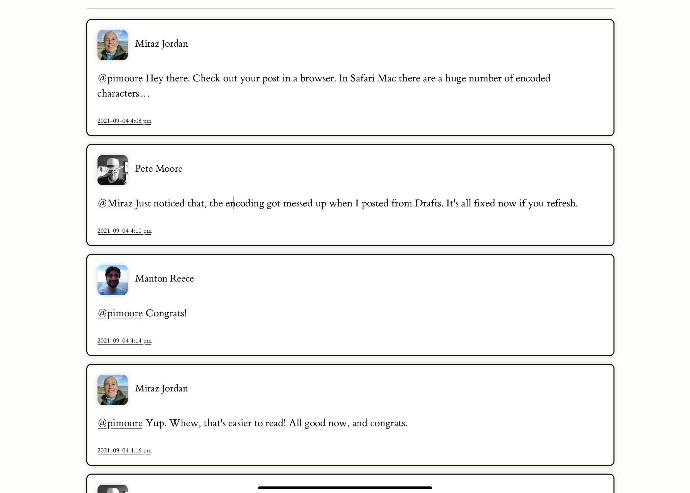
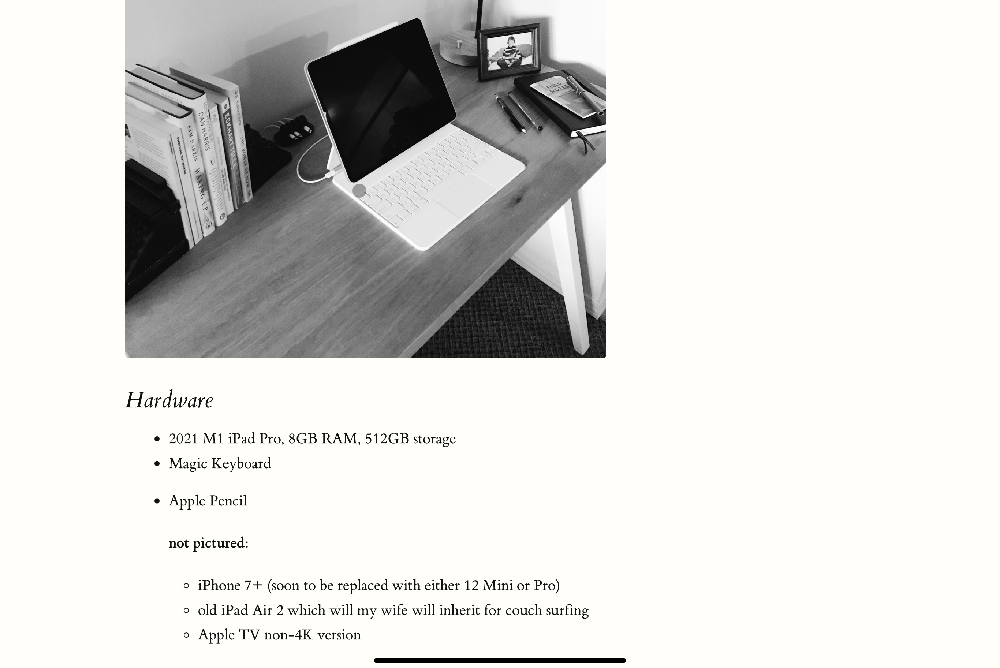
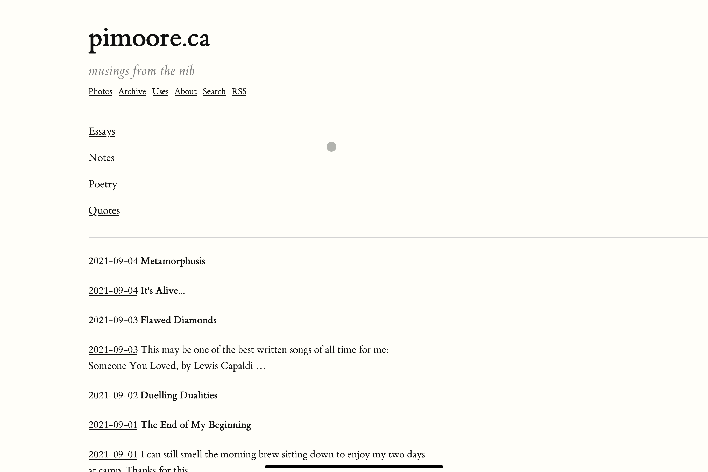
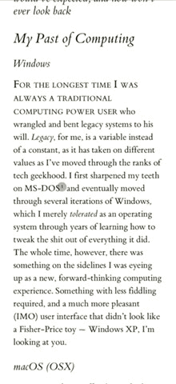

# Tufte for Micro.blog

**A clean and beautiful theme based on the design and typography styles of Edward Tufte.**  Based heavily on the [Tufte-CSS](https://edwardtufte.github.io/tufte-css/) project by Dave Liepmann with my own tweaks and additions for Micro.blog, and ported from the [Hugo-Tufte theme](https://github.com/slashformotion/hugo-tufte) by SlashForMotion.

## Features

* Well spaced main content with use of sidebar elements for figures, margin notes, and sidenotes instead of footnotes, and plenty of whitespace
* Dark mode version
* Hugo shortcodes for various elements:
	* blockquote
	* cite
	* div
	* epigraph
	* figure
	* marginnote
	* newthought
	* section
	* sidenote
	* summary
	* poetry
* Fully styled Micro.blog conversation elements
* **Poetry styling!**
	* "poetry" shortcode creates a ```<pre><code>``` block with the poem text
	* css styles the block with normal et-book text to look like a normal post but maintains indents and line returns
	* css also removes the horizontal scroll of long lines, instead word-wrapping normally at whitespace depending on screen width
* Added customizable site subtitle in config.json
* Added mailto: address in config.json, and auto includes "Reply by email" link at the bottom of each post
	* subject will automatically include the title if one is available, otherwise will include the permalink
	
## Shortcode Usage

All of these shortcodes use the standard Hugo syntax of <code></code> to open and <code></code> to close.  Some of them use inner parameters in addition to text between the open and closing blocks.

**Note for Ulysses: shortcodes need to be opened and closed by adding a tilde (~) on each end, which tells the software to keep it as raw source.** - Credit to @moondeer on Micro.blog for this tip!

### Blockquote & Epigraph

Blockquote is a shortcode version of the standard Markdown blockquote option, except it provides parameters to add attribution information to the quote:
* pre: name
* cite: attribution source
* link: creates a link to the website using the cite value as the URL label
	* **Note:** due to how Hugo handles external URLs, the link must be entered without the http(s): portion, instead only using //site-name/link/ (see example below)
* post: optional to add trailing attribution info after the cite, such as page number references

**Epigraph uses the same parameters** but this is used to highlight special passages or quotes either within or at the beginning of an article, or even a quote style post.  They are formatted in slightly smaller and italic text as opposed to blockquotes which are only indented.  Think of the epigraph as the Tufte equivalent of pullquotes.

Code example:
```
blockquote text goes here
```

### Cite

This does the same thing as the parameter version, except can be run as it's own separate shortcode.  It will format the text in smaller italics.

Code example: 
```
cite name here
```

### Div & Section

These are shortcodes used to code <code>\<div\></code> and <code>\<section\></code> blocks, and can use the 'class' and 'id' parameters.  To close the block, use <code></code>.
	
Code example:
```

	/* block content */

```

### Figure

Allows the insertion of figures into your article, and uses three different formats:
* regular - same as the article text width
* full - takes up the full body width including the side margin
* margin - places the figure and image in the margin, and treats it as a marginnote

The full and margin options are specified using the 'type' parameter, otherwise it will use the regular width if the type parameter is not present.

Figure also uses the following paramaters:
* title: the figure title in bold
* caption: the figure caption text
* alt: the image description
* label: the **unique** figure label text (this is for the marginnote toggle to work properly)
* src: the url of the figure image
* attrlink: the attribution link URL
* attr: the link label for the attribution

Code example:
```

```

### Sidenote & Marginnote

These both place notes in the side margin, except in the case of sidenote it will add a sequential number to each one just like footnotes normally do.  These both use an inner unique label to identify the note.

Code example:
```
sidenote text goes here
```

### Newthought

This is a span of small cap styled text that can be used to highlight the start of sections.

Code example:
```
Here is the start of a section that is using the newthought shortcode.
```

### Summary

This shortcode is used to add a post synopsis or summary to longer, titled essay style articles.  It's used in conjunction with a 'more' divider that will display only the summary on the index page followed by a link to read the article in full.

Code example:
```
# Post title

This is the post summary text that will be displayed by itself on the index page.<!--more-->
/* post content starts here */
```

### Poetry

The poetry shortcode is an optional coding shortcut that can be used for poetry writing that maintains line returns and tab spaces for unique poem formatting.  It puts the text content into a code block, but then changes the styling to match the ET-book serif font that all articles use.  It will also perform word wrapping at whitespaces between words (dependant on the screen width of the device).

Code example:
```

Now is the time
	for all good men
		to come to the aid of the party

```

## URL Slug Control

Micro.blog is unique in how it handles URL slugs, normally capturing the first three words of the title or article text.  However, when writing a title-less short-form post in Tufte that _starts with a shortcode_, such as epigraph/blockquote for a quote style post, or poetry, the shortcode text itself gets picked up as one of the URL slug words.  To get around this, you can use a hidden paragraph html tag with the slug title you want to use. **Note: M.b. will still use only the first three words**

Code example:
```
<p hidden>slug title here</p>
Now is the time for all good men to come to the aid of the party.
```

## built-in plugin support
* support in the layout and styling for the following plugins has been built-in to Hitchens, and will take affect automatically as long as the plugin is installed
	- Reply by Email, by @sod -- shows a customizable link to allow people to reply to your post via email
	- Conversation on Micro.blog, by @sod -- shows a customizable link to allow people to reply to your post via Micro.blog
	- Surprise Me!, by @sod -- shows in the main menu
	- Post Stats, by @amit -- shows in the main menu with a link to its own page
	
## On This Day support
* based on the plugin by @cleverdevil, with custom code added to work and style properly with Hitchens
* requires setting up a new custom "On This Day" page and setting it to display in your navigation, then inserting the following code into the page content:

```
<div id="on-this-day">
  <div class="center">Loading...</div>
</div>

<script>
var container = document.getElementById('on-this-day');

function renderPost(post) {
    var postEl = document.createElement('article');
    postEl.className = 'post h-entry';
    container.appendChild(postEl);
    
    if (post['properties']['name'] != null) {
        var dividedEl = document.createElement('div');
        dividedEl.className = 'divided';
        postEl.appendChild(dividedEl);
        var titleEl = document.createElement('h1');
        titleEl.className = 'content-title';
        titleEl.innerText = post['properties']['name'][0];
        dividedEl.appendChild(titleEl);
    }

    var contentEl = document.createElement('section');
    contentEl.className = 'post-content e-content';
    contentEl.innerHTML = post['properties']['content'][0]['html'];
    postEl.appendChild(contentEl);

    var postmetaEl = document.createElement('div');
    postmetaEl.className = 'post-meta';
    contentEl.appendChild(postmetaEl);    

    var postdateEl = document.createElement('div');
    postdateEl.className = 'article-post-date';
    postmetaEl.appendChild(postdateEl);

    var permalinkEl = document.createElement('a');
    permalinkEl.className = 'permalink u-url';
    permalinkEl.href = post['properties']['url'][0];
    postdateEl.appendChild(permalinkEl);

    var publishedEl = document.createElement('time');
    publishedEl.className = 'dt-published';
    publishedEl.datetime = post['properties']['published'][0];

    var published = post['properties']['published'][0];
    published = new Date(published.slice(0,19).replace(' ', 'T'));

    publishedEl.innerText = published.toDateString();
    permalinkEl.appendChild(publishedEl);

    var ruleEl = document.createElement('hr');
    container(ruleEl);

}

function renderNoContent() {
    var noPostsEl = document.createElement('div');
	noPostsEl.className = 'center';
    noPostsEl.innerText = 'No posts found for this day. Check back tomorrow!';
    container.appendChild(noPostsEl);
}

var xhr = new XMLHttpRequest();
xhr.responseType = "json";
xhr.open('GET', "https://micromemories.cleverdevil.io/posts?tz=America/Toronto", true);
xhr.send();

xhr.onreadystatechange = function(e) {
    if (xhr.readyState == 4 && xhr.status == 200) {
        container.innerHTML = '';
        if (xhr.response.length == 0) {
            renderNoContent();
        } else {
            xhr.response.forEach(function(post) {
                renderPost(post);
            });
        }
    }
}
</script>
```
* **be sure to change the timezone setting to the correct one for you**
	
## Installing the theme
	
Tufte is available as a full plugin on Micro.blog.  Before installing _Tufte_ be sure to remove any custom CSS, other theme plugins, and set your template to blank.  Then save the changes, after which you can install the plugin for this theme.  If things aren't working or displaying properly, you may have to remove **all plugins** first, save the changes and install _Tufte_, then add back the other plugins.  Once the theme is successfully installed, you can configure the subtitle and mailto parameters as explained below:
	
### Changing the "subtitle" and "description" parameters in config.json
	
_Tufte_ includes a configurable subtitle, as well as site description.  Once you've installed the theme plugin on your account per the above instructions, these parameters can be adjusted in the plugin settings.  These new parameter values should be kept anytime the plugin receives an update to its codebase.
	
## Screenshots

### Index




### Post Page



### Micro.blog Conversation


### Content Page



### Archives



### Mobile Sidenote/Marginnote Expansion

On smaller mobile screens the sidenotes, marginnotes and margin figures will be replaced with a tappable button that toggles their display.  For sidenotes, tapping the number will toggle it, while marginnotes and figures will be identified by a ⊕ symbol.



## Credits

* Dave Liepmann - [Tufte-CSS project](https://github.com/edwardtufte/tufte-css/)<br />
* SlashForMotion - [Hugo-Tufte theme](https://github.com/slashformotion/hugo-tufte)<br />
* Leon Paternoster (@leonp on Micro.blog) for his numerous excellent posts on font spacing, typography and legibility
* Jason Cardwell (@moondeer on Micro.blog) for his Ulysses tip for shortcode handling
* Manton Reece (@manton on Micro.blog) for creating the Micro.blog platform

## Ported to Micro.blog by

Pete Moore

* https://github.com/pimoore

## License

Licensed under the MIT License. See the [LICENSE](https://github.com/pimoore/theme-tufte/blob/main/LICENSE.md) file for more details.
